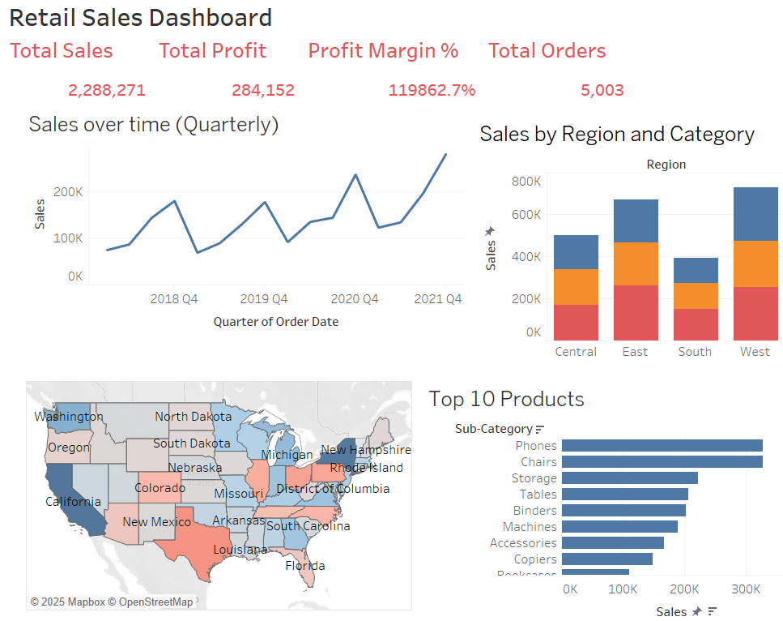

# Retail Sales Performance Dashboard

## About the Project

Designed and developed an interactive Tableau dashboard inspired by real-world retail operations (e.g., Walmart, Target) to analyze sales and profitability performance across the U.S.

## Key Features:

*KPI Summary Section highlighting Total Sales, Total Profit, Profit Margin %, and Total Orders using dynamic cards

*Profitability Heatmap by State using U.S. geographic visualization colored by SUM(Profit) (green = profitable, red = loss-making)

*Dynamic Tooltips displaying state-level Sales, Profit, and Order Volume

*Filters and Drilldowns by Category, Sub-Category, and Quarter to enable executive-level decision-making

## Dataset & Cleaning

SOURCE - https://www.kaggle.com/datasets/truongdai/tableau-sample-superstore

Data Cleaning

* The column 'kmDriven' is in units km. Each entry had the string ‘km’ at the end of the
values. The unnecessary string was removed.
* Converted 'kmDriven' into miles and renamed the column to ‘distDriven (miles)’.
* The 'distDriven (miles)' column had 47 missing (blank) values. These will need to be
handled to avoid issues in further calculations. Removed blank/null values from the
‘distDriven (miles)’ column.
* No other columns have null values, ensuring data integrity for those fields.
* Column ‘AskPrice’ had special characters (₹ ) in front of each price. Cleaned data by
removing the ‘₹’ from each price.
* Column ‘AskPrice’unit is converted to Million Rupees by dividing by 1,000,000.

## Tableau Visualization

I utilized Tableau to create a visual representation of the data. 

### Snapshots

**DASHBOARD**

## Conclusion

## How to Use

To view the visualization, follow these steps:
1. Download the Tableau workbook from the repository.
2. Open Tableau Desktop or Tableau Public.
3. Open the downloaded workbook to interact with the visualization.
