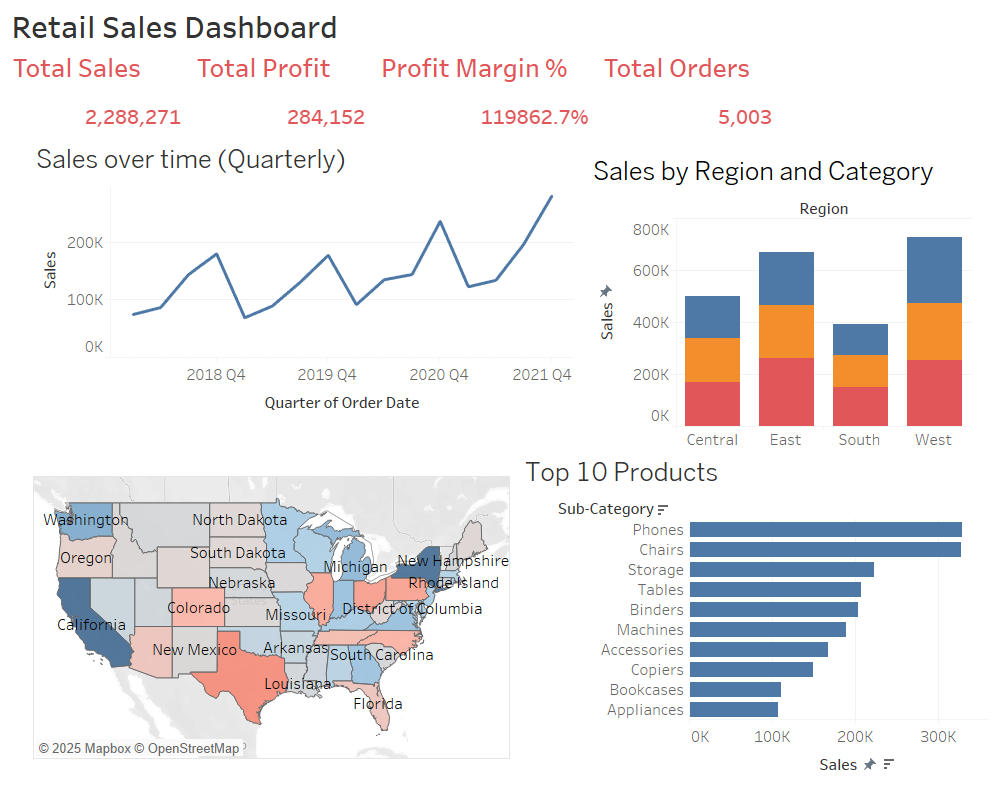

# Retail Sales Performance Dashboard

## About the Project

Designed and developed an interactive Tableau dashboard inspired by real-world retail operations (e.g., Walmart, Target) to analyze sales and profitability performance across the U.S.

## Key Features:

*KPI Summary Section highlighting Total Sales, Total Profit, Profit Margin %, and Total Orders using dynamic cards

*Profitability Heatmap by State using U.S. geographic visualization colored by SUM(Profit) (green = profitable, red = loss-making)

*Dynamic Tooltips displaying state-level Sales, Profit, and Order Volume

*Filters and Drilldowns by Category, Sub-Category, and Quarter to enable executive-level decision-making

## Dataset & Cleaning

SOURCE - https://www.kaggle.com/datasets/truongdai/tableau-sample-superstore

Data Cleaning

Used Python code (data_cleaning.py) to clean data in the original downloaded dataset.
* Handled Missing and Duplicate Values: Removed all rows containing null values and eliminated duplicate rows.
* Converted Date Columns: Transformed 'Order Date' and 'Ship Date' columns to datetime format using pd.to_datetime() with dayfirst=True to correctly interpret date formats.
* Standardized Column Names: Converted all column names to lowercase for consistency and easier referencing.
* Created New Derived Columns: Calculated 'profit margin' as the ratio of profit to sales. Extracted 'order year' and 'order month' from the order date for time-based analysis.
* Exported Cleaned Data: Saved the cleaned and enriched dataset to a new CSV file named 'Sample_Superstore.csv' without the index column.

## Tableau Visualization

I utilized Tableau to create a visual representation of the data. 

### Snapshots

**DASHBOARD**

## Conclusion

## How to Use

To view the visualization, follow these steps:
1. Download the Tableau workbook from the repository.
2. Open Tableau Desktop or Tableau Public.
3. Open the downloaded workbook to interact with the visualization.
